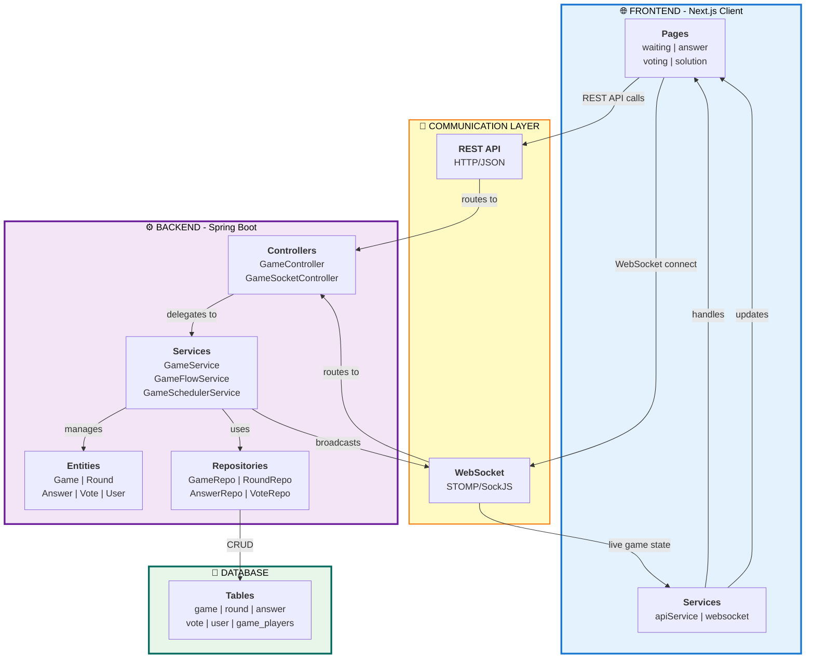
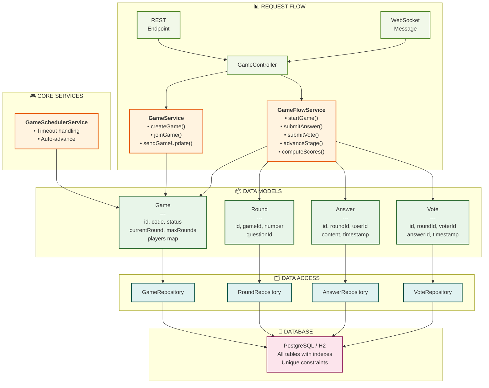

# Game Backend & Frontend Architecture

## High-Level Overview (Simplified)

```mermaid
graph TB
    subgraph Client["🌐 FRONTEND - Next.js Client"]
        Pages["<b>Pages</b><br/>waiting | answer<br/>voting | solution"]
        FEServices["<b>Services</b><br/>apiService | websocket"]
    end
    
    subgraph API["🔌 COMMUNICATION LAYER"]
        REST["<b>REST API</b><br/>HTTP/JSON"]
        WS["<b>WebSocket</b><br/>STOMP/SockJS"]
    end
    
    subgraph Server["⚙️ BACKEND - Spring Boot"]
        Controllers["<b>Controllers</b><br/>GameController<br/>GameSocketController"]
        Services["<b>Services</b><br/>GameService<br/>GameFlowService<br/>GameSchedulerService"]
        Entities["<b>Entities</b><br/>Game | Round<br/>Answer | Vote | User"]
        Repos["<b>Repositories</b><br/>GameRepo | RoundRepo<br/>AnswerRepo | VoteRepo"]
    end
    
    subgraph DB["💾 DATABASE"]
        Tables["<b>Tables</b><br/>game | round | answer<br/>vote | user | game_players"]
    end
    
    %% Frontend connections
    Pages -->|REST API calls| REST
    Pages -->|WebSocket connect| WS
    FEServices -->|handles| Pages
    
    %% Backend connections
    REST -->|routes to| Controllers
    WS -->|routes to| Controllers
    Controllers -->|delegates to| Services
    Services -->|manages| Entities
    Services -->|uses| Repos
    Repos -->|CRUD| Tables
    Services -->|broadcasts| WS
    
    %% Frontend updates
    WS -->|live game state| FEServices
    FEServices -->|updates| Pages
    
    %% Styling
    classDef frontend fill:#e3f2fd,stroke:#1976d2,stroke-width:3px,color:#000
    classDef api fill:#fff9c4,stroke:#f57f17,stroke-width:2px,color:#000
    classDef backend fill:#f3e5f5,stroke:#6a1b9a,stroke-width:3px,color:#000
    classDef db fill:#e8f5e9,stroke:#00695c,stroke-width:3px,color:#000
    
    class Client frontend
    class API api
    class Server backend
    class DB db
```

---

## Detailed Backend Architecture

```mermaid
graph TB
    subgraph "📊 REQUEST FLOW"
        direction LR
        In1["REST<br/>Endpoint"] --> C["GameController"]
        In2["WebSocket<br/>Message"] --> C
        C --> GS["GameService"]
        C --> GF["GameFlowService"]
    end
    
    subgraph "🎮 CORE SERVICES"
        GS["<b>GameService</b><br/>• createGame()<br/>• joinGame()<br/>• sendGameUpdate()"]
        GF["<b>GameFlowService</b><br/>• startGame()<br/>• submitAnswer()<br/>• submitVote()<br/>• advanceStage()<br/>• computeScores()"]
        GD["<b>GameSchedulerService</b><br/>• Timeout handling<br/>• Auto-advance"]
    end
    
    subgraph "📦 DATA MODELS"
        E1["Game<br/>---<br/>id, code, status<br/>currentRound, maxRounds<br/>players map"]
        E2["Round<br/>---<br/>id, gameId, number<br/>questionId"]
        E3["Answer<br/>---<br/>id, roundId, userId<br/>content, timestamp"]
        E4["Vote<br/>---<br/>id, roundId, voterId<br/>answerId, timestamp"]
    end
    
    subgraph "🗂️ DATA ACCESS"
        R1["GameRepository"]
        R2["RoundRepository"]
        R3["AnswerRepository"]
        R4["VoteRepository"]
    end
    
    subgraph "💾 DATABASE"
        DB["PostgreSQL / H2<br/>All tables with indexes<br/>Unique constraints"]
    end
    
    %% Service to Data flow
    GS --> E1
    GF --> E1 & E2 & E3 & E4
    GD --> E1
    
    %% Data to Repo flow
    E1 --> R1
    E2 --> R2
    E3 --> R3
    E4 --> R4
    
    %% Repo to DB
    R1 & R2 & R3 & R4 --> DB
    
    %% Styling
    classDef service fill:#fff3e0,stroke:#e65100,stroke-width:2px
    classDef entity fill:#e8f5e9,stroke:#1b5e20,stroke-width:2px
    classDef repo fill:#e0f2f1,stroke:#004d40,stroke-width:2px
    classDef database fill:#fce4ec,stroke:#880e4f,stroke-width:2px
    classDef request fill:#f1f8e9,stroke:#558b2f,stroke-width:2px
    
    class GS,GF,GD service
    class E1,E2,E3,E4 entity
    class R1,R2,R3,R4 repo
    class DB database
    class In1,In2,C request
```
